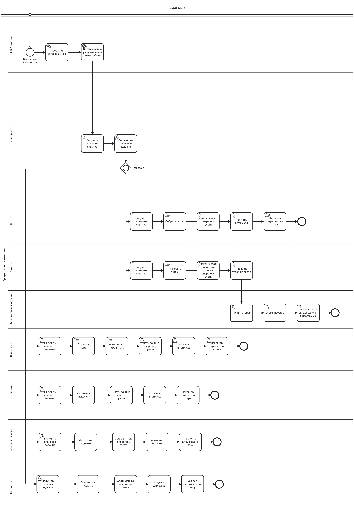

# BRD (Business Requirements Document) для ERP-системы

**Название проекта:** Разработка ERP системы на производство  
**Версия:** 1.0  
**Дата:** 03.03.2026  
**Автор:** Власов Евгений

---

## 1. Введение

### 1.1 Цель документа

Цель данного документа — детализировать бизнес-требования к ERP-системе на основе утверждённого Vision & Scope. Документ служит основой для разработки технического задания (ТЗ) и обеспечивает единое понимание требований между бизнес-заказчиком и командой разработки.

### 1.2 Предпосылки и контекст

Потребность в проекте обусловлена следующими проблемами текущего состояния:

| Проблема | Влияние на бизнес |
|----------|-------------------|
| Отсутствие единого информационного пространства | Данные разрознены (Excel, бумага, 1С), сбор информации занимает дни |
| Большие запасы материалов и НЗП | Замороженные оборотные средства, высокие затраты на хранение |
| Отсутствие аналитики и управленческого учёта | Решения принимаются на основе устаревших данных |
| Неэффективная работа склада | Ошибки учёта, пересортица, длительное время инвентаризации |
| Перепроизводство и недопроизводство | Потери материалов, срывы сроков отгрузки клиентам |
| Плохое планирование производства | Простои оборудования, неравномерная загрузка цехов |

---

## 2. Заинтересованные стороны

| Роль | Должность / Участники | Интересы | Уровень влияния |
|------|----------------------|----------|-----------------|
| Владелец продукта | Генеральный директор | Прозрачность бизнес-процессов, контроль KPI, сокращение издержек | Высокий |
| Ключевой стейкхолдер | Финансовый директор | Управленческая отчётность, финансовая прозрачность | Высокий |
| Ключевой стейкхолдер | Операционный директор | Прозрачность производства, выполнение плана | Высокий |
| Основной пользователь | Снабженцы, экономисты, кадровики, менеджеры по продажам | Быстрый поиск информации, возможность быстрее решать задачи по своей работе | Средний |
| Пользователь (внесение данных) | Кладовщики, диспетчеры производства, табельщики, операторы учёта | Быстрое внесение данных, минимизация ошибок, понятный интерфейс | Низкий |
| Пользователь (просмотр) | Рабочие цеха, операторы станков, упаковщики | Понятное задание и план на смену | Низкий |
| Администратор системы | IT-отдел, команда разработки, команда внедрения | Согласованные правила для понятной и быстрой разработки, стабильность системы | Высокий |

### 2.1 Матрица влияния и заинтересованности

| Стейкхолдер | Влияние | Заинтересованность | Стратегия работы |
|-------------|---------|-------------------|------------------|
| Генеральный директор | Высокое | Высокая | Тесное вовлечение, регулярные отчёты |
| Финансовый директор | Высокое | Высокая | Тесное вовлечение, согласование требований |
| Операционный директор | Высокое | Высокая | Тесное вовлечение, согласование процессов |
| IT-отдел | Высокое | Высокая | Тесное вовлечение, технические согласования |
| Офисный персонал | Среднее | Высокая | Регулярные демо, сбор обратной связи |
| Цеховой персонал | Низкое | Средняя | Обучение, инструкции, поддержка |
| Линейный персонал | Низкое | Низкая | Минимальное вовлечение (через мастеров) |

---

## 3. Текущее положение дел (As-Is)

### 3.1 Описание процесса

1. **Вход:** Месячный план от отдела сбыта
   - Поступает месячный план продаж/производства

2. **Мастер цеха решает:** "НЗП достаточно?"
   - Проверяется, хватает ли незавершенного производства (полуфабрикатов) для выполнения плана
   - Если НЗП достаточно → идем по ветке Б
   - Если НЗП не хватает → идем по ветке А

3. **Ветка А (НЗП не хватает):**
   - Выбираем чего не хватает
   - Отправляем задание по одному или нескольким возможным вариантам:
     - Отправить задание на резку → порезать металл → положить в накопитель для штрипса
     - Отправить задание на штамповку → произвести продукцию на штамповке → отправить НЗП на линию цинкования
     - Отправить задание на холодную высадку → произвести НЗП → отправить на линию цинкования
   - НЗП с линии цинкования отправить в цех

4. **Ветка Б (НЗП достаточно):**
   - Мастер формирует задание на сборку
   - Сборщик собирает изделие
   - Мастер получает информацию о собранном изделии
   - Мастер формирует задание на упаковку
   - Упаковщик собирает
   - Мастер получает информацию об упакованном изделии
   - Мастер отправляет продукцию на склад
   - Кладовщик принимает продукцию
   - Кладовщик вносит информацию в компьютер

### 3.2 Проблемы

1. **Размытая логика принятия решений**
   - Непонятно, как это определяет мастер. По каким критериям? Есть ли цифры (остатки в штуках/кг) или это "на глаз"? Нет интеграции с системой учета остатков.

2. **Дублирование и несогласованность заданий**
   - Нет единого производственного плана. Каждое задание живет своей жизнью. Как они синхронизируются? Что, если резчики сделали, а штамповщики не успевают?

3. **Огромное количество бумаги**
   - Бумажный документооборот, бюрократия, потери времени на хождение с бумажками. Люди больше подписывают, чем делают.

4. **Разрыв между производством и учетом**
   - Учет постфактум, а не в реальном времени. Между фактическим выпуском и внесением в систему проходит время → данные всегда устаревшие.

5. **Нет обратной связи**
   - Нет контура управления. Если что-то пошло не так (брак, нехватка материала), система не видит этого, пока не упрется в тупик.

6. **Нет приоритетов**
   - Если одновременно приходит 10 заказов, что делать первым? Нет механизма приоритизации.

### 3.3 BPMN схема as-is

---

## 4. Целевое состояние (To-Be)

### 4.1 Описание процесса

1. **Вход:** Месячный план от отдела сбыта
   - План продаж вносится непосредственно в ERP-систему отделом сбыта.
   - *Изменение vs As-Is:* Единая точка входа, исключение ручной передачи

2. **ERP-система проверяет:** «НЗП и сырьё достаточно?»
   - Система автоматически сверяет план с фактическими остатками:
     - НЗП (незавершённое производство) в цехах
     - Сырьё на складе
     - Загруженность производственных линий
   - Если НЗП и сырьё достаточно → ERP формирует задание на сборку
   - Если НЗП или сырьё не хватает → ERP формирует задания на производство полуфабрикатов
   - *Изменение vs As-Is:* Автоматизация принятия решений на основе актуальных данных

3. **Ветка А (НЗП или сырьё не хватает):**

   **3.1. Линия резки:**
   - Мастер получает уведомление из ERP
   - Оператор распечатывает плановое задание
   - Рабочий линии резки получает задание
   - Порезать металл → поместить в накопитель
   - Сдать данные оператору учёта (количество, вес)
   - Получить штрихкод от оператора
   - Наклеить штрихкод на штрипс
   - Партия готова к передаче на следующий этап

   **3.2. Пресс-автомат (штамповка):**
   - Мастер получает уведомление из ERP
   - Оператор распечатывает плановое задание
   - Рабочий пресса получает задание
   - Изготовить изделие → сдать данные оператору учёта (количество)
   - Получить штрихкод от оператора → наклеить штрихкод на тару
   - Партия готова к передаче

   **3.3. Холодная высадка:**
   - Мастер получает уведомление из ERP
   - Оператор распечатывает плановое задание
   - Рабочий высадки получает задание
   - Изготовить изделие → сдать данные оператору учёта (количество)
   - Получить штрихкод от оператора → наклеить штрихкод на тару
   - Партия готова к передаче

   **3.4. Линия цинкования:**
   - Мастер получает уведомление из ERP
   - Оператор распечатывает плановое задание
   - Рабочий цинкования получает задание (партию со штрипсом/изделием)
   - Оцинковать изделие → сдать данные оператору учёта (количество, вес)
   - Получить штрихкод от оператора → наклеить штрихкод на тару
   - Партия готова к передаче в цех сборки

4. **Ветка Б (НЗП достаточно):**

   **4.1. Сборка:**
   - Мастер получает уведомление из ERP
   - Оператор распечатывает плановое задание
   - Сборщик получает задание
   - Собрать петлю (из комплектующих со штрихкодами)
   - Сдать данные оператору учёта (количество собранных изделий)
   - Получить штрихкод от оператора → наклеить штрихкод на тару
   - Партия готова к упаковке

   **4.2. Упаковка:**
   - Мастер получает уведомление из ERP
   - Оператор распечатывает плановое задание
   - Упаковщик получает задание (партию со штрихкодом)
   - Упаковать петлю → отсканировать штрихкод ИЛИ сдать данные оператору учёта
   - Передать товар на склад

   **4.3. Склад готовой продукции:**
   - Кладовщик принимает товар
   - Отсканировать штрихкод
   - Поставить на складской учёт в программе (ERP автоматически обновляет остатки)
   - Заказ выполнен

### 4.2 Итоговая таблица: 6 проблем As-Is → Решение в To-Be

| № | Проблема As-Is | Как решено в To-Be | Где в схеме |
|---|----------------|-------------------|-------------|
| 1 | Размытая логика принятия решений (Мастер «на глаз» решает) | ERP проверяет остатки автоматически, решения на основе цифр | Шаг 1: ERP проверка остатков и НЗП |
| 2 | Дублирование и несогласованность заданий | Единый план в ERP, все процессы синхронизированы, видна связь между этапами | Шаг 2: Формирование уведомлений и плана работы |
| 3 | Огромное количество бумаги | Электронные задания, штрихкодирование, сканирование вместо ручного ввода | Шаг 3-4: Сдача данных оператору + штрихкод на тару |
| 4 | Разрыв между производством и учётом | Данные вносятся сразу после операции, остатки обновляются в реальном времени | Шаг 3: Сдать данные оператору учёта (после каждой операции) |
| 5 | Нет обратной связи | Штрихкод на каждом этапе, статус виден в ERP, расхождения фиксируются сразу | Шаг 4-7: Сканирование на всех этапах передачи |
| 6 | Нет приоритетов | ERP формирует план с приоритетами, Мастер получает готовые задания | Шаг 1-2: ERP формирование плана работы |

### 4.3 BPMN схема to-be

---

## 5. Область проекта

### 5.1 Входит в проект

*Примечание: Детальное описание модулей приведено в документе Vision & Scope, Раздел 3.1 и 3.2.*

| Модуль | Приоритет | Версия | Краткое описание |
|--------|-----------|--------|------------------|
| Складской учёт (WMS) | Must | 1.0 | Приёмка, перемещение, отгрузка, инвентаризация, адресное хранение |
| Спецификации (BOM) | Must | 1.0 | Создание и ведение спецификаций изделий, многоуровневая структура |
| Планирование материалов (MRP) | Must | 1.0 | Расчёт потребности в сырье, формирование заявок на закупку |
| Интеграция с 1С | Must | 1.0 | Обмен справочниками, остатками, данными о производстве и закупках |
| Штрихкодирование | Must | 1.0 | Генерация и сканирование штрихкодов и QR-кодов |
| Пользователи и права | Must | 1.0 | Регистрация, авторизация, роли |
| Управление производством | Should | 2.0 | Планирование заданий, учёт НЗП, контроль операций |
| Закупки | Should | 2.0 | Управление поставщиками, заказы, контроль поставок |
| Продажи | Should | 2.0 | Управление заказами клиентов, отгрузка, счета |
| Отчётность и аналитика | Should | 2.0 | Оперативные отчёты, дашборды, KPI |
| Финансы | Could | 3.0 | Учёт затрат, калькуляция себестоимости |
| Кадры | Could | 3.0 | Табель рабочего времени, сменное планирование |

### 5.2 Не входит в проект

*Примечание: Детальное описание исключений приведено в документе Vision & Scope, Раздел 3.3.*

| Исключение | Обоснование | Возможность в будущем |
|------------|-------------|----------------------|
| CRM-система | Базовое управление заказами без полноценной CRM | Версия 4.0+ |
| Мобильное приложение (нативное) | Только адаптивный веб-интерфейс в MVP | Версия 4.0 |
| Прямая интеграция со станками (IoT) | Датчики и станки не подключаются в ранних версиях | Версия 4.0 |
| Платёжный шлюз | Внутренняя система, платежи не обрабатываются | Не планируется |
| Мультиязычность | Только русский язык в рамках проекта | Версия 4.0+ |
| Электронная подпись | Не предусмотрено в текущей версии | Версия 4.0+ |
| EDI с контрагентами | Нет в рамках MVP | Версия 4.0 |

### 5.3 Дорожная карта по версиям

| Версия | Срок | Ключевые модули | Бюджет | Критерий готовности |
|--------|------|-----------------|--------|---------------------|
| 1.0 (MVP) | 01.10.2026 | WMS, BOM, MRP, Штрихкоды, 1С (базовая), Пользователи | 40% | Запуск на одном складе, 20 пользователей |
| 2.0 | 01.07.2027 | Производство, Закупки, Продажи, Отчётность | 30% | Полное покрытие основных процессов |
| 3.0 | 01.04.2028 | Финансы, Кадры, расширенная аналитика | 20% | Полное внедрение на предприятии |
| 4.0 | 01.01.2029 | Оптимизация, Мобильное приложение, IoT | 10% | Стабилизация и масштабирование |

---

## 6. Бизнес-требования

### 6.1 Версия 1.0 (MVP) — Must

#### Блок 1: Складской учёт (WMS)

| ID | Требование | Бизнес-ценность | Связь с Vision | Критерий приёмки |
|----|-------------|-----------------|----------------|------------------|
| BR-WMS-01 | Система должна обеспечивать учёт материалов и готовой продукции по складским ячейкам с уникальными идентификаторами | Исключить пересортицу, сократить время инвентаризации с 3 дней до 4 часов | Полнота информации (<5 мин) | Каждая ячейка имеет уникальный код, поиск по ячейке работает |
| BR-WMS-02 | Система должна фиксировать все перемещения товаров между ячейками с указанием времени и ответственного | Обеспечить прослеживаемость товаров, выявить потери | Прозрачность процессов | История перемещений доступна для каждой партии |
| BR-WMS-03 | Система должна поддерживать приёмку товара с сверкой фактического количества с плановым | Исключить ошибки приёмки, выявить недостачу от поставщика | Ошибки ввода <1% | Расхождение >5% блокирует приёмку, требует подтверждения |
| BR-WMS-04 | Система должна поддерживать отгрузку товара по принципу FIFO (первый пришёл — первый ушёл) | Снизить риск порчи материалов, устаревания запасов | Оборачиваемость 6 оборотов/год | Система подсказывает, какую партию отгружать первой |
| BR-WMS-05 | Система должна автоматически обновлять остатки на складе после каждой операции приёмки/отгрузки/перемещения | Исключить разрыв между физическим наличием и учётом | Полнота информации (<5 мин) | Остатки актуальны в реальном времени, задержка <1 мин |
| BR-WMS-06 | Система должна позволять проводить инвентаризацию по расписанию или выборочно без остановки складских операций | Сократить простой склада во время инвентаризации | Ускорение обработки информации | Инвентаризация части ячеек не блокирует работу с остальными |
| BR-WMS-07 | Система должна формировать задания кладовщику на отбор/размещение товара с оптимальным маршрутом по складу | Сократить время на складские операции на 30% | Ускорение обработки информации | Маршрут минимизирует перемещения кладовщика |

#### Блок 2: Спецификации (BOM)

| ID | Требование | Бизнес-ценность | Связь с Vision | Критерий приёмки |
|----|-------------|-----------------|----------------|------------------|
| BR-BOM-01 | Система должна позволять создавать многоуровневые спецификации изделий с указанием всех компонентов и их количества | Обеспечить точный расчёт потребности в материалах | Точность планирования 85%+ | Спецификация может содержать вложенные изделия (до 10 уровней) |
| BR-BOM-02 | Система должна поддерживать версионирование спецификаций с указанием даты вступления в силу | Исключить ошибки производства из-за устаревших спецификаций | Точность планирования 85%+ | История изменений спецификации доступна, можно откатиться к версии |
| BR-BOM-03 | Система должна позволять указывать единицы измерения для каждого компонента спецификации (шт., кг, м) | Обеспечить корректный расчёт потребности в материалах | Точность планирования 85%+ | Поддержка конвертации между ЕИ (кг → шт. через вес 1 шт.) |
| BR-BOM-04 | Система должна позволять указывать процент технологических потерь для каждого материала в спецификации | Учесть реальный расход материалов, избежать недостачи | Снизить запасы сырья на 15% | Потери учитываются в MRP автоматически |

#### Блок 3: Планирование материалов (MRP)

| ID | Требование | Бизнес-ценность | Связь с Vision | Критерий приёмки |
|----|-------------|-----------------|----------------|------------------|
| BR-MRP-01 | Система должна автоматически рассчитывать потребность в сырье на основе производственного плана, BOM и текущих остатков | Исключить ручной расчёт, снизить риск ошибок | Снизить запасы сырья на 15% | Расчёт выполняется за <5 минут для плана на месяц |
| BR-MRP-02 | Система должна формировать заявки на закупку при выявлении дефицита материалов с указанием срока поставки | Исключить простои производства из-за нехватки материалов | Процент выполнения плана 90%+ | Заявка создаётся автоматически при остатке < точки заказа |
| BR-MRP-03 | Система должна учитывать сроки поставки материалов от поставщиков при формировании плана закупок | Избежать срывов производства из-за поздней поставки | Процент выполнения плана 90%+ | Срок поставки указан в справочнике поставщиков, учитывается в расчёте |
| BR-MRP-04 | Система должна позволять пересчитывать план потребности при изменении производственного плана | Обеспечить актуальность плана закупок при изменениях | Точность планирования 85%+ | Пересчёт выполняется за <2 минуты |
| BR-MRP-05 | Система должна показывать «проецируемые остатки» (плановое наличие с учётом будущих поступлений и расходов) | Позволить планировать производство с учётом будущих поставок | Точность планирования 85%+ | Отчёт показывает остатки на любую дату в будущем |

#### Блок 4: Интеграция с 1С

| ID | Требование | Бизнес-ценность | Связь с Vision | Критерий приёмки |
|----|-------------|-----------------|----------------|------------------|
| BR-1C-01 | Система должна автоматически получать справочник номенклатуры из 1С:Бухгалтерия при изменении | Исключить двойное ведение справочников, снизить ошибки | Исключить дублирование ввода | Синхронизация выполняется ежедневно, расхождений нет |
| BR-1C-02 | Система должна автоматически передавать данные о выпуске продукции в 1С для учёта затрат | Обеспечить корректный расчёт себестоимости в 1С | Прозрачность себестоимости | Данные передаются в течение 5 минут после выпуска |
| BR-1C-03 | Система должна автоматически получать остатки материалов из 1С при старте работы | Обеспечить корректный старт MRP с актуальными данными | Полнота информации (<5 мин) | Остатки загружаются при запуске системы, расхождений нет |
| BR-1C-04 | Система должна логировать все обмены данными с 1С с указанием статуса (успех/ошибка) | Обеспечить возможность аудита и отладки интеграции | Надёжность системы | Лог доступен администратору, ошибки уведомляют ответственного |

#### Блок 5: Штрихкодирование

| ID | Требование | Бизнес-ценность | Связь с Vision | Критерий приёмки |
|----|-------------|-----------------|----------------|------------------|
| BR-BAR-01 | Система должна генерировать штрихкоды (Code 128, EAN-13) и QR-коды для каждой партии продукции | Обеспечить быструю идентификацию партий на всех этапах | Ошибки ввода <1% | Штрихкод читается сканером с первого раза в 99% случаев |
| BR-BAR-02 | Система должна позволять печатать этикетки со штрихкодом на принтере в цеху сразу после операции | Исключить задержки маркировки, ускорить передачу партии | Ускорение обработки информации | Этикетка печатается за <10 секунд после ввода данных |
| BR-BAR-03 | Система должна позволять сканировать штрихкод при приёмке, отгрузке, перемещении и инвентаризации | Исключить ручной ввод, снизить ошибки учёта | Ошибки ввода <1% | Сканирование заменяет ручной ввод полностью |
| BR-BAR-04 | Система должна связывать штрихкод партии с данными о производстве (дата, операция, исполнитель, сырьё) | Обеспечить прослеживаемость продукции на всём цикле | Прозрачность процессов | По штрихкоду доступна полная история партии |
| BR-BAR-05 | Система должна позволять сканировать штрихкод через USB-сканер или веб-камеру | Обеспечить гибкость в выборе оборудования для разных участков | Гибкость внедрения | Оба способа сканирования работают корректно |

#### Блок 6: Пользователи и права

| ID | Требование | Бизнес-ценность | Связь с Vision | Критерий приёмки |
|----|-------------|-----------------|----------------|------------------|
| BR-AUTH-01 | Система должна поддерживать роли пользователей (Администратор, Мастер цеха, Оператор учёта, Кладовщик, Менеджер) | Обеспечить разграничение доступа, защитить данные от несанкционированного изменения | Безопасность данных | Каждая роль имеет уникальный набор прав |
| BR-AUTH-02 | Система должна позволять назначать права на уровне модулей (чтение/запись/удаление) | Обеспечить гибкое управление доступом для разных сотрудников | Безопасность данных | Права настраиваются без изменения кода системы |
| BR-AUTH-03 | Система должна логировать все действия пользователей с указанием времени, пользователя и операции | Обеспечить аудит действий, выявить несанкционированные операции | Аудит и безопасность | Лог хранится 12 месяцев, доступен для экспорта |
| BR-AUTH-04 | Система должна блокировать учётную запись после 5 неудачных попыток входа | Защитить систему от подбора паролей | Безопасность данных | Блокировка снимается администратором через 30 минут |

#### Блок 7: Отчётность и аналитика

| ID | Требование | Бизнес-ценность | Связь с Vision | Критерий приёмки |
|----|-------------|-----------------|----------------|------------------|
| BR-REP-01 | Система должна предоставлять дашборд с ключевыми показателями (запасы, НЗП, выполнение плана) в реальном времени | Сократить время подготовки отчётности для руководства | Отчётность за 2 часа | Дашборд обновляется автоматически каждые 5 минут |
| BR-REP-02 | Система должна позволять формировать отчёт по движению партии за весь производственный цикл | Обеспечить прослеживаемость продукции | Прозрачность процессов | Отчёт формируется за <30 секунд |
| BR-REP-03 | Система должна позволять экспортировать отчёты в Excel/PDF для передачи внешним получателям | Обеспечить совместимость с существующими процессами | Ускорение обработки информации | Экспорт работает для всех отчётов |
| BR-REP-04 | Система должна позволять настраивать период отчёта (день/неделя/месяц/квартал) | Обеспечить гибкость анализа данных | Ускорение обработки информации | Все периоды работают корректно |

### 6.2 Версия 2.0 — Should

#### Блок 2.1: Управление производством

| ID | Требование | Бизнес-ценность | Связь с Vision | Критерий приёмки |
|----|-------------|-----------------|----------------|------------------|
| BR-PROD-01 | Система должна позволять создавать производственные задания по цехам и рабочим местам с указанием срока выполнения | Обеспечить прозрачность загрузки цехов, исключить простои | Процент выполнения плана 90%+ | Задание создаётся за <2 минут, видна загрузка цеха |
| BR-PROD-02 | Система должна позволять фиксировать выполнение каждой операции с указанием времени начала и окончания | Обеспечить учёт трудозатрат, выявить узкие места | Точность планирования 85%+ | Время операции записывается автоматически при сканировании |
| BR-PROD-03 | Система должна позволять учитывать НЗП по операциям с указанием места нахождения партии | Снизить уровень НЗП на 20%, исключить потери партий | Снижение НЗП на 20% | По любой партии видно, на какой операции находится |
| BR-PROD-04 | Система должна позволять фиксировать брак с указанием причины и ответственного | Выявить системные проблемы производства, снизить процент брака | Ошибки ввода <1% | Брак фиксируется за <1 минуту, причина выбирается из справочника |
| BR-PROD-05 | Система должна позволять переносить производственные задания при изменении приоритетов | Обеспечить гибкость планирования при срочных заказах | Процент выполнения плана 90%+ | Перенос задания выполняется за <1 минуту |
| BR-PROD-06 | Система должна показывать плановую и фактическую загрузку цехов по дням/неделям | Позволить планировать ресурсы производства | Точность планирования 85%+ | Отчёт формируется за <30 секунд |
| BR-PROD-07 | Система должна позволять закрывать производственную партию с фиксацией всех затрат | Обеспечить корректный расчёт себестоимости | Прозрачность себестоимости | Партия закрывается после всех операций, данные сохраняются |

#### Блок 2.2: Закупки

| ID | Требование | Бизнес-ценность | Связь с Vision | Критерий приёмки |
|----|-------------|-----------------|----------------|------------------|
| BR-PURCH-01 | Система должна позволять создавать заказы поставщикам на основе заявок от MRP | Исключить ручной расчёт заказов, снизить риск ошибок | Снизить запасы сырья на 15% | Заказ создаётся из заявки в 1 клик |
| BR-PURCH-02 | Система должна позволять вести справочник поставщиков с указанием сроков поставки, цен, рейтинга | Выбирать надёжных поставщиков, избегать срывов поставок | Процент выполнения плана 90%+ | Рейтинг поставщика обновляется автоматически после каждой поставки |
| BR-PURCH-03 | Система должна позволять контролировать сроки поставки заказов поставщикам | Избежать простоев производства из-за нехватки материалов | Процент выполнения плана 90%+ | Alert за 3 дня до срока поставки, если товар не поступил |
| BR-PURCH-04 | Система должна позволять фиксировать входной контроль качества материалов от поставщиков | Выявить брак до запуска в производство | Ошибки ввода <1% | Акт входного контроля создаётся за <5 минут |
| BR-PURCH-05 | Система должна позволять оценивать поставщиков по критериям (срок, цена, качество) | Оптимизировать закупки, работать с лучшими поставщиками | Снизить запасы сырья на 15% | Отчёт по поставщикам формируется за <30 секунд |

#### Блок 2.3: Продажи

| ID | Требование | Бизнес-ценность | Связь с Vision | Критерий приёмки |
|----|-------------|-----------------|----------------|------------------|
| BR-SALES-01 | Система должна позволять создавать заказы клиентов с указанием срока отгрузки | Обеспечить прозрачность обязательств перед клиентами | Время обработки заказа 1 день | Заказ создаётся за <5 минут |
| BR-SALES-02 | Система должна позволять резервировать товар на складе под заказ клиента | Исключить ситуацию «продали то, чего нет на складе» | Время обработки заказа 1 день | Резервирование выполняется автоматически при создании заказа |
| BR-SALES-03 | Система должна позволять контролировать отгрузку товара по заказам | Исключить срывы сроков отгрузки | Время обработки заказа 1 день | Alert за 1 день до срока отгрузки, если товар не отгружен |
| BR-SALES-04 | Система должна позволять формировать счета на оплату для клиентов | Ускорить процесс выставления счетов | Ускорение обработки информации | Счёт формируется из заказа в 1 клик |
| BR-SALES-05 | Система должна позволять контролировать дебиторскую задолженность по клиентам | Снизить риск неоплаты, улучшить cash flow | Прозрачность процессов | Отчёт по дебиторке формируется за <30 секунд |

#### Блок 2.4: Отчётность и аналитика (расширенная)

| ID | Требование | Бизнес-ценность | Связь с Vision | Критерий приёмки |
|----|-------------|-----------------|----------------|------------------|
| BR-REP-05 | Система должна предоставлять настраиваемые дашборды для разных ролей (директор, мастер, кладовщик) | Обеспечить каждую роль релевантной информацией | Отчётность за 2 часа | Каждая роль видит свой дашборд при входе |
| BR-REP-06 | Система должна позволять сравнивать плановые и фактические показатели производства | Выявить отклонения, принять корректирующие меры | Точность планирования 85%+ | Отчёт формируется за <30 секунд |
| BR-REP-07 | Система должна позволять анализировать динамику запасов по периодам | Выявить сезонность, оптимизировать закупки | Снизить запасы сырья на 15% | График строится за <10 секунд |
| BR-REP-08 | Система должна позволять формировать отчёт по эффективности сотрудников (выработка, брак) | Мотивировать сотрудников, выявить проблемы | Процент выполнения плана 90%+ | Отчёт формируется за <30 секунд |
| BR-REP-09 | Система должна позволять настраивать автоматическую рассылку отчётов по расписанию | Исключить ручную подготовку регулярных отчётов | Отчётность за 2 часа | Рассылка работает по расписанию (день/неделя/месяц) |

### 6.3 Версия 3.0 — Could

#### Блок 3.1: Финансы

| ID | Требование | Бизнес-ценность | Связь с Vision | Критерий приёмки |
|----|-------------|-----------------|----------------|------------------|
| BR-FIN-01 | Система должна рассчитывать фактическую себестоимость партии на основе расхода материалов и трудозатрат | Обеспечить точное ценообразование, выявить убыточные продукты | Прозрачность себестоимости | Себестоимость рассчитывается автоматически после закрытия партии |
| BR-FIN-02 | Система должна позволять учитывать затраты по статьям (материалы, зарплата, энергия, амортизация) | Обеспечить детальный анализ структуры затрат | Прозрачность себестоимости | Статьи затрат настраиваются без изменения кода |
| BR-FIN-03 | Система должна позволять формировать отчёт о прибылях и убытках по продуктам/заказам | Оценить рентабельность продукции | Прозрачность себестоимости | Отчёт формируется за <1 минуту |
| BR-FIN-04 | Система должна позволять планировать бюджет производства на период | Обеспечить финансовое планирование | Прозрачность процессов | Бюджет создаётся на месяц/квартал/год |
| BR-FIN-05 | Система должна позволять сравнивать плановую и фактическую себестоимость | Выявить перерасход затрат | Прозрачность себестоимости | Отчёт формируется за <30 секунд |
| BR-FIN-06 | Система должна позволять учитывать курсовые разницы по импортным материалам | Обеспечить точный учёт затрат | Прозрачность себестоимости | Курсы загружаются автоматически из внешнего источника |
| BR-FIN-07 | Система должна передавать финансовые данные в 1С:Бухгалтерия для формирования проводок | Исключить двойной ввод финансовых данных | Исключить дублирование ввода | Данные передаются в течение 5 минут после операции |

#### Блок 3.2: Кадры

| ID | Требование | Бизнес-ценность | Связь с Vision | Критерий приёмки |
|----|-------------|-----------------|----------------|------------------|
| BR-HR-01 | Система должна позволять вести учёт рабочего времени сотрудников по сменам | Обеспечить корректный расчёт зарплаты | Ускорение обработки информации | Табель заполняется автоматически на основе данных производства |
| BR-HR-02 | Система должна позволять планировать смены сотрудников с учётом производственного плана | Исключить простои из-за нехватки персонала | Процент выполнения плана 90%+ | План смен создаётся за <30 минут |
| BR-HR-03 | Система должна позволять учитывать выработку сотрудников для расчёта сдельной зарплаты | Мотивировать сотрудников, обеспечить справедливую оплату | Процент выполнения плана 90%+ | Выработка рассчитывается автоматически после каждой операции |
| BR-HR-04 | Система должна позволять вести справочник сотрудников с указанием должностей, цехов, ставок | Обеспечить учёт персонала | Ускорение обработки информации | Справочник синхронизируется с 1С:ЗУП |
| BR-HR-05 | Система должна передавать данные о выработке и отработанном времени в 1С:ЗУП | Исключить двойной ввод данных о персонале | Исключить дублирование ввода | Данные передаются в течение 5 минут после закрытия смены |

---

## 7. Ограничения и допущения

### 7.1 Ограничения

| Тип | Описание |
|-----|----------|
| Бюджет | Общий бюджет проекта на версию 1.0 (MVP) утвержден в размере [сумма] руб. Превышение допустимо не более чем на 10% по согласованию с инвестиционным комитетом. |
| Сроки | Версия 1.0 должна быть введена в опытную эксплуатацию до 01.10.2026. Версия 2.0 — до 01.07.2027. |
| Нормативные | БД: PostgreSQL 14+; Серверное ПО: совместимость с Ubuntu 22.04 LTS; Клиент: только веб-интерфейс, нативные мобильные приложения не разрабатываются в рамках проекта; Интеграция с 1С: только через REST API (прямой доступ к БД 1С запрещен) |
| Технические | Соответствие 152-ФЗ при работе с персональными данными; Обеспечение прослеживаемости товаров для целей налогового учета |
| Организационные | Рабочие цеха не имеют прямого доступа к ERP в рамках MVP (v1.0). Все данные вносятся через Операторов учёта. |

### 7.2 Допущения

| № | Допущение |
|---|-----------|
| 1 | Пользователи обладают базовой компьютерной грамотностью (уверенная работа с браузером, клавиатурой) |
| 2 | Существующие справочники номенклатуры и спецификации доступны в электронном виде и пригодны для миграции (не менее 95% данных корректны) |
| 3 | Сетевая инфраструктура предприятия обеспечивает стабильную работу веб-приложения во всех цехах и на складах (проверено до начала разработки) |
| 4 | Ключевые сотрудники заказчика (технологи, кладовщики, мастера) готовы выделять время на участие в проектировании и тестировании (в среднем 8 часов в неделю) |
| 5 | Оборудование (сканеры, принтеры, терминалы) закупается и настраивается заказчиком самостоятельно, не входит в бюджет разработки |
| 6 | Бизнес-процессы предприятия не претерпят фундаментальных изменений в течение первых 18 месяцев проекта |
| 7 | Интеграция с 1С возможна через штатные API (начиная с версии 1С:Предприятие 8.3.20) |

### 7.3 Риски проекта

| Риск | Вероятность | Влияние | Митигация |
|------|-------------|---------|-----------|
| Сопротивление персонала | Средняя (3/5) | Высокое (4/5) | Раннее вовлечение, обучение, «чемпионы» в отделах |
| Ошибки миграции данных | Высокая (4/5) | Высокое (5/5) | Тестовая миграция, двойной ввод на переходный период |
| Недостаток времени/ресурсов | Высокая (4/5) | Высокое (5/5) | Приоритизация MVP, фокус на критических модулях |
| Изменение требований | Средняя (3/5) | Среднее (3/5) | Фиксация Scope, процесс Change Request |
| Недостаточная инфраструктура | Средняя (3/5) | Высокое (4/5) | Аудит ИТ до начала, план модернизации |
| Ключевые сотрудники покидают проект | Средняя (3/5) | Высокое (4/5) | Документирование знаний, кросс-обучение, дублёры |

### 7.4 Зависимости

| Зависимость | Тип | Описание | Срок |
|-------------|-----|----------|------|
| Сканеры штрихкодов (USB HID) | Внешнее | Закупка заказчиком | До начала внедрения v1.0 |
| Принтеры этикеток | Внешнее | Закупка заказчиком | До начала внедрения v1.0 |
| Серверная инфраструктура | Внешнее | Размещение системы | До начала внедрения v1.0 |
| Стабильная локальная сеть | Внешнее | 100 Мбит/с офисы, 50 Мбит/с цеха | До начала внедрения v1.0 |
| Интеграция с 1С:Бухгалтерия | Внешнее | API доступно (1С 8.3.20+) | Версия 1.0 |
| Справочники номенклатуры | Внутреннее | Миграция данных (95% корректны) | До начала внедрения v1.0 |

---

## 8. Критерии успеха

### 8.1 Критерии успеха проекта

| Метрика | Базовое значение | Целевое значение | Срок |
|---------|------------------|------------------|------|
| Уровень запасов сырья | 100% | Снижение на 15% | 6 месяцев |
| Уровень НЗП | 100% | Снижение на 20% | 12 месяцев |
| Время отчётности | 3-5 дней | 2 часа | 3 месяца |
| Точность планирования | ~60% | 85%+ | 6 месяцев |
| Ошибки ввода данных | ~5% | <1% | 3 месяца |

### 8.2 Критерии утверждения BRD

| № | Критерий | Как проверяется |
|---|----------|-----------------|
| 1 | Все требования согласованы со стейкхолдерами | Лист согласования подписан |
| 2 | Все требования трассируемы к бизнес-целям | Матрица трассировки заполнена |
| 3 | Требования непротиворечивы | Нет конфликтов между требованиями |
| 4 | Требования тестируемы | Для каждого требования есть критерий приёмки |
| 5 | Все термины из глоссария использованы корректно | Проверка аналитиком |
| 6 | Схема процессов (BPMN) согласована с участниками | Подписи от владельцев процессов |
| 7 | Документ прошёл ревью | Отметка в истории версий |

---

## 9. Приложения

### 9.1 Глоссарий

| Термин | Определение |
|--------|-------------|
| ERP (Enterprise Resource Planning) | Система планирования ресурсов предприятия, которая интегрирует все основные бизнес-процессы организации в единую информационную систему |
| НЗП (Незавершённое производство) | Продукция, находящаяся в процессе производства, но не прошедшая все технологические операции и не готовая к реализации |
| BOM (Bill of Materials) | Спецификация изделия — структурированный перечень всех компонентов, сырья и материалов, необходимых для производства единицы готовой продукции |
| MRP (Material Requirements Planning) | Метод планирования потребности в материалах и сырье на основе производственного плана, спецификаций (BOM) и текущих остатков на складе |
| WMS (Warehouse Management System) | Система управления складом — модуль для учёта приёмки, хранения, перемещения и отгрузки товаров |
| BPMN (Business Process Model and Notation) | Нотация моделирования бизнес-процессов — стандарт для графического описания процессов |
| As-Is | Текущее состояние бизнес-процесса (до внедрения системы) |
| To-Be | Целевое состояние бизнес-процесса (после внедрения системы) |
| Стейкхолдер | Заинтересованное лицо — участник проекта, чьи интересы затрагиваются при внедрении системы |
| Штрихкод | Машиночитаемый идентификатор товара для ускорения складских операций |

### 9.2 Ссылки на документы

| Документ | Версия | Дата | Статус |
|----------|--------|------|--------|
| Vision & Scope | 1.0 | 02.03.2026 | Утверждён |
| Положение о закупках | 2.0 | 01.12.2025 | Утверждён |
| Регламент складского учёта | 1.5 | 15.01.2026 | Утверждён |
| Инструкция по производственному планированию | 1.0 | 10.02.2026 | В работе |

### 9.3 История версий

| Версия | Дата | Автор | Изменения |
|--------|------|-------|-----------|
| 1.0 | 05.03.2026 | Власов Евгений | Первая редакция |

### 9.4 Матрица трассировки требований

*Назначение: Обеспечить связь между бизнес-требованиями (BR), целями из Vision & Scope и модулями системы для последующей трассировки на Epic и User Stories.*

| ID требования | Требование (кратко) | Версия | Цель из Vision & Scope | Модуль |
|---------------|---------------------|--------|------------------------|--------|
| BR-WMS-01 | Учёт по складским ячейкам | 1.0 | Полнота информации (<5 мин) | WMS |
| BR-WMS-02 | Фиксация перемещений товаров | 1.0 | Прозрачность процессов | WMS |
| BR-WMS-03 | Приёмка с сверкой количества | 1.0 | Ошибки ввода <1% | WMS |
| BR-WMS-04 | Отгрузка по FIFO | 1.0 | Оборачиваемость 6 оборотов/год | WMS |
| BR-WMS-05 | Автообновление остатков | 1.0 | Полнота информации (<5 мин) | WMS |
| BR-WMS-06 | Инвентаризация без остановки | 1.0 | Ускорение обработки информации | WMS |
| BR-WMS-07 | Задания с оптимальным маршрутом | 1.0 | Ускорение обработки информации | WMS |
| BR-BOM-01 | Многоуровневые спецификации | 1.0 | Точность планирования 85%+ | BOM |
| BR-BOM-02 | Версионирование спецификаций | 1.0 | Точность планирования 85%+ | BOM |
| BR-BOM-03 | Единицы измерения в BOM | 1.0 | Точность планирования 85%+ | BOM |
| BR-BOM-04 | Учёт технологических потерь | 1.0 | Снизить запасы сырья на 15% | BOM |
| BR-MRP-01 | Авторасчёт потребности в сырье | 1.0 | Снизить запасы сырья на 15% | MRP |
| BR-MRP-02 | Заявки на закупку при дефиците | 1.0 | Процент выполнения плана 90%+ | MRP |
| BR-MRP-03 | Учёт сроков поставки | 1.0 | Процент выполнения плана 90%+ | MRP |
| BR-MRP-04 | Пересчёт при изменении плана | 1.0 | Точность планирования 85%+ | MRP |
| BR-MRP-05 | Проецируемые остатки | 1.0 | Точность планирования 85%+ | MRP |
| BR-1C-01 | Получение номенклатуры из 1С | 1.0 | Исключить дублирование ввода | 1С Интеграция |
| BR-1C-02 | Передача выпуска в 1С | 1.0 | Прозрачность себестоимости | 1С Интеграция |
| BR-1C-03 | Получение остатков из 1С | 1.0 | Полнота информации (<5 мин) | 1С Интеграция |
| BR-1C-04 | Логирование обмена с 1С | 1.0 | Надёжность системы | 1С Интеграция |
| BR-BAR-01 | Генерация штрихкодов | 1.0 | Ошибки ввода <1% | Штрихкодирование |
| BR-BAR-02 | Печать этикеток в цеху | 1.0 | Ускорение обработки информации | Штрихкодирование |
| BR-BAR-03 | Сканирование на всех этапах | 1.0 | Ошибки ввода <1% | Штрихкодирование |
| BR-BAR-04 | Связь штрихкода с данными | 1.0 | Прозрачность процессов | Штрихкодирование |
| BR-BAR-05 | Сканирование USB/веб-камера | 1.0 | Гибкость внедрения | Штрихкодирование |
| BR-AUTH-01 | Роли пользователей | 1.0 | Безопасность данных | Пользователи и права |
| BR-AUTH-02 | Права на уровне модулей | 1.0 | Безопасность данных | Пользователи и права |
| BR-AUTH-03 | Логирование действий | 1.0 | Аудит и безопасность | Пользователи и права |
| BR-AUTH-04 | Блокировка при неудачном входе | 1.0 | Безопасность данных | Пользователи и права |
| BR-REP-01 | Дашборд KPI в реальном времени | 1.0 | Отчётность за 2 часа | Отчётность |
| BR-REP-02 | Отчёт по движению партии | 1.0 | Прозрачность процессов | Отчётность |
| BR-REP-03 | Экспорт в Excel/PDF | 1.0 | Ускорение обработки информации | Отчётность |
| BR-REP-04 | Настройка периода отчёта | 1.0 | Ускорение обработки информации | Отчётность |
| BR-PROD-01 | Производственные задания по цехам | 2.0 | Процент выполнения плана 90%+ | Производство |
| BR-PROD-02 | Фиксация выполнения операций | 2.0 | Точность планирования 85%+ | Производство |
| BR-PROD-03 | Учёт НЗП по операциям | 2.0 | Снижение НЗП на 20% | Производство |
| BR-PROD-04 | Фиксация брака с причиной | 2.0 | Ошибки ввода <1% | Производство |
| BR-PROD-05 | Перенос заданий при изменении | 2.0 | Процент выполнения плана 90%+ | Производство |
| BR-PROD-06 | Плановая и фактическая загрузка | 2.0 | Точность планирования 85%+ | Производство |
| BR-PROD-07 | Закрытие партии с затратами | 2.0 | Прозрачность себестоимости | Производство |
| BR-PURCH-01 | Заказы поставщикам из MRP | 2.0 | Снизить запасы сырья на 15% | Закупки |
| BR-PURCH-02 | Справочник поставщиков с рейтингом | 2.0 | Процент выполнения плана 90%+ | Закупки |
| BR-PURCH-03 | Контроль сроков поставки | 2.0 | Процент выполнения плана 90%+ | Закупки |
| BR-PURCH-04 | Входной контроль качества | 2.0 | Ошибки ввода <1% | Закупки |
| BR-PURCH-05 | Оценка поставщиков | 2.0 | Снизить запасы сырья на 15% | Закупки |
| BR-SALES-01 | Заказы клиентов со сроком | 2.0 | Время обработки заказа 1 день | Продажи |
| BR-SALES-02 | Резервирование товара | 2.0 | Время обработки заказа 1 день | Продажи |
| BR-SALES-03 | Контроль отгрузки по заказам | 2.0 | Время обработки заказа 1 день | Продажи |
| BR-SALES-04 | Формирование счетов | 2.0 | Ускорение обработки информации | Продажи |
| BR-SALES-05 | Контроль дебиторской задолженности | 2.0 | Прозрачность процессов | Продажи |
| BR-REP-05 | Настраиваемые дашборды по ролям | 2.0 | Отчётность за 2 часа | Отчётность |
| BR-REP-06 | Сравнение плана и факта | 2.0 | Точность планирования 85%+ | Отчётность |
| BR-REP-07 | Динамика запасов по периодам | 2.0 | Снизить запасы сырья на 15% | Отчётность |
| BR-REP-08 | Эффективность сотрудников | 2.0 | Процент выполнения плана 90%+ | Отчётность |
| BR-REP-09 | Авто-рассылка отчётов | 2.0 | Отчётность за 2 часа | Отчётность |
| BR-FIN-01 | Расчёт себестоимости партии | 3.0 | Прозрачность себестоимости | Финансы |
| BR-FIN-02 | Учёт затрат по статьям | 3.0 | Прозрачность себестоимости | Финансы |
| BR-FIN-03 | Отчёт о прибылях и убытках | 3.0 | Прозрачность себестоимости | Финансы |
| BR-FIN-04 | Планирование бюджета | 3.0 | Прозрачность процессов | Финансы |
| BR-FIN-05 | Сравнение плановой и фактической себестоимости | 3.0 | Прозрачность себестоимости | Финансы |
| BR-FIN-06 | Учёт курсовых разниц | 3.0 | Прозрачность себестоимости | Финансы |
| BR-FIN-07 | Передача финансовых данных в 1С | 3.0 | Исключить дублирование ввода | Финансы |
| BR-HR-01 | Учёт рабочего времени по сменам | 3.0 | Ускорение обработки информации | Кадры |
| BR-HR-02 | Планирование смен | 3.0 | Процент выполнения плана 90%+ | Кадры |
| BR-HR-03 | Учёт выработки для зарплаты | 3.0 | Процент выполнения плана 90%+ | Кадры |
| BR-HR-04 | Справочник сотрудников | 3.0 | Ускорение обработки информации | Кадры |
| BR-HR-05 | Передача данных в 1С:ЗУП | 3.0 | Исключить дублирование ввода | Кадры |

---

## 10. Контекст для архитектурной схемы (C4)

### 10.1 Границы системы

| Входит | Не входит |
|--------|-----------|
| Веб-клиент (адаптивный) | Мобильное приложение (v4.0+) |
| Серверное API | Прямая интеграция со станками |
| База данных (PostgreSQL) | Платёжный шлюз |
| Интеграция с 1С (REST API) | CRM (внешняя) |
| Штрихкодирование (сканеры USB HID) | EDI с контрагентами (v4.0+) |

### 10.2 Внешние системы

| Система | Направление | Протокол | Данные | Версия |
|---------|-------------|----------|--------|--------|
| 1С:Бухгалтерия | Двусторонний | REST API | Справочники, остатки, проводки | 1.0 |
| 1С:ЗУП | Односторонний | REST API | Кадры, табель | 3.0 |
| Email-сервер | Односторонний | SMTP | Уведомления пользователям | 1.0 |
| Весы | Односторонний | USB/COM | Вес партии | 1.0 |
| Сканеры штрихкодов | Односторонний | USB HID | Штрихкод | 1.0 |
| Принтеры этикеток | Односторонний | USB | Печать штрихкодов | 1.0 |

### 10.3 Пользователи (для C4 Container)

| Роль | Количество | Доступ | Интерфейс |
|------|------------|--------|-----------|
| Мастер цеха | 5 | Веб-интерфейс (полный) | ПК в кабинете |
| Оператор учёта | 10 | Веб-интерфейс (ввод данных) | ПК в цеху |
| Кладовщик | 5 | Веб-интерфейс (склад) | ПК + сканер |
| Офисный персонал | 20 | Веб-интерфейс (чтение/отчёты) | ПК в офисе |
| Топ-менеджмент | 5 | Веб-интерфейс (дашборды) | ПК/планшет |

### 10.4 Потоки данных (для C4 Component)

| Источник | Приёмник | Данные | Частота |
|----------|----------|--------|---------|
| Отдел сбыта | ERP | План продаж | Ежемесячно |
| ERP | 1С:Бухгалтерия | Справочники, остатки | Ежедневно |
| Оператор учёта | ERP | Данные о производстве | После операции |
| ERP | Склад | Обновление остатков | Мгновенно |
| Весы | ERP | Вес партии | После операции |
| ERP | Email-сервер | Уведомления | По событию |

---
